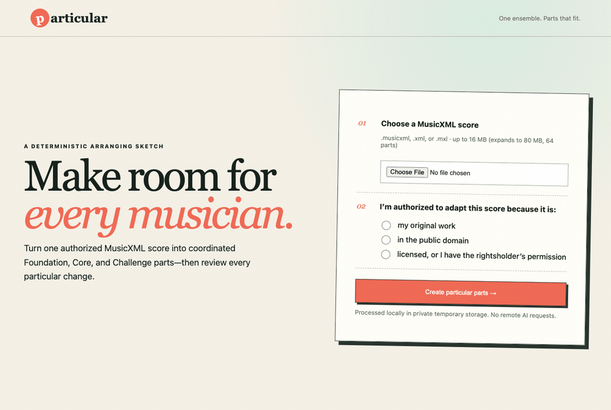

# Particular

Adaptive arrangements for mixed-ability ensembles. Particular turns one authorized MusicXML ensemble score into coordinated Foundation, Core, and Challenge parts that stay musically compatible — then lets a director review, adjust, and mix them part by part.

A deterministic engine does the arranging (re-runs are byte-identical and every change is auditable); the browser demo wraps it in a **score-aware review workspace**: a per-measure score map, per-part downloads, measure locks with targeted regeneration, mixed-tier sets that draw each part from its own tier, an engraved sheet-music preview, and in-browser audition playback. Generated parts are suggestions that require director review before rehearsal — the tool is explicit about that throughout. The [MVP plan](docs/plans/2026-07-18-001-feat-particular-mvp-plan.md) defines the original product contract and implementation sequence.

## See it in action



Upload an authorized score → review the per-measure score map → lock a measure → engrave the tier as sheet music → audition it → assign each part its own tier → download the coordinated mixed set. (Recorded against the local demo; PDF export appears here as its explicit fallback because MuseScore was not installed.)

## Provenance

Particular was built at a hackathon. The work up to and including commit `4fd0e5a` was authored by OpenAI Codex; everything after that line is later work by Sarah Lewis with Claude (Anthropic). Two records keep that line verifiable:

- [Codex authorship boundary](docs/provenance/codex-authorship-boundary.md) — exactly what Codex built, decided, and deliberately left undone.
- [Post-boundary work](docs/provenance/post-boundary-work.md) — every PR built after the line, mapped to the issues it closes, and what remains honestly not-done (notably: no arrangement has yet been judged by a human musician).

## Repository layout

- `apps/web`: director-facing TypeScript application
- `packages/contracts`: generated and hand-authored cross-service schemas
- `packages/api-client`: generated TypeScript API client
- `services/arranger`: Python musical-domain engine and service
- `evaluation`: authorized corpus metadata, fixtures, rubrics, and results
- `infrastructure`: deployment and isolated-worker assets
- `docs`: product decisions, architecture records, and plans

Musical decisions belong in `services/arranger`; the web application orchestrates workflows and presents results. See [ADR 0001](docs/architecture/0001-system-boundaries.md), the [supported MusicXML semantics](docs/architecture/supported-musicxml.md), and [CONCEPTS.md](CONCEPTS.md).

## Prerequisites

- Node.js 24 LTS or newer
- pnpm 10 or newer (enable through Corepack where available)
- Python 3.12 or newer
- uv 0.10.2

## Setup

```sh
pnpm install
uv sync --frozen --extra dev
```

## Validation

The routine fast gate is:

```sh
pnpm check
uv run ruff format --check .
uv run ruff check .
uv run mypy services evaluation
uv run pytest
```

`pnpm check` runs formatting, linting, TypeScript checking, and workspace tests. The Python commands are intentionally separate so failures remain legible. Run `pnpm check:evaluation` for the separate licensed-corpus integrity gate.

## Deterministic demo CLI

Run the hackathon pipeline from the repository environment:

```sh
uv run python -m particular.cli preflight evaluation/fixtures/string-orchestra-second-violin.musicxml
uv run python -m particular.cli analyze evaluation/fixtures/string-orchestra-second-violin.musicxml
uv run python -m particular.cli generate evaluation/fixtures/string-orchestra-second-violin.musicxml demo-output
```

`generate` accepts `.musicxml`, `.xml`, and safely bounded `.mxl` inputs. The output directory must not already exist. Particular publishes the normalized original, all three deterministic tiers, an analysis report, and an auditable manifest together; invalid input does not leave a partial output directory. This baseline makes no remote AI requests.

The analysis report records each part's matched instrument profile and confidence. When a score's part name and declared MusicXML instrument conflict, choose the intended profile explicitly, for example `--instrument-profile P1=violin` on `analyze` or `generate`.

## Local browser demo

Start the hackathon interface:

```sh
uv run python -m particular.demo
```

Open `http://127.0.0.1:8765`, attest that you are authorized to adapt the score, and upload MusicXML. The interface is a director-facing review workspace:

- **Difficulty & change ledger** — instrument-aware difficulty features per part and the accepted or rejected change ledger for each tier.
- **Score map** — a per-measure grid per part; changed measures are highlighted and selectable to see exactly what happened.
- **Measure locks** — lock the measures you approve and regenerate only the rest; locks are recorded in the audit manifest.
- **Mixed-tier sets** — assign each part its own tier (a Foundation cello beside Core violins) and export one coordinated set.
- **Engraved preview** — render the selected tier as real sheet music.
- **Audition** — play the original or any tier through a built-in synth, all parts together or one part solo.
- **Downloads** — the normalized source, all three tiers, per-part and mixed-tier MusicXML, the analysis report, and the audit manifest.

Print-ready **PDF export** is available when [MuseScore](https://musescore.org/) is installed on the host (set `PARTICULAR_MUSESCORE` to its path, or put it on `PATH`). When MuseScore is absent, the demo says so explicitly and points to the MusicXML downloads and the engraved preview instead — PDF is an optional enhancement, never a hard requirement.

The demo binds to loopback only, stores up to eight completed jobs in private temporary storage, removes older artifacts as new jobs finish, deletes each job 30 minutes after it is created (enforced by a background sweep and before every download), supports an explicit "Delete these files" action, and clears everything when the server stops. Generated parts require director review before rehearsal or distribution.

The engine and CLI make **no remote requests of any kind**. The browser demo is the same, with one deliberate exception: the engraved preview loads the [OpenSheetMusicDisplay](https://opensheetmusicdisplay.org/) rendering library from a CDN the first time you use it. Your score is still engraved locally in the browser and is never uploaded, and the rest of the workspace works offline.

## Contributing

Read [AGENTS.md](AGENTS.md) before changing the repository. Work on a feature branch, keep changes scoped, use conventional commits, and update architecture or product documentation when a cross-cutting decision changes. Generated contracts must be reproducible; do not edit generated clients by hand.

Only public-domain, original, or explicitly authorized score material may enter the project. Do not commit private scores, personal research data, credentials, or generated user artifacts. See [rights and privacy](docs/product/rights-and-privacy.md).
