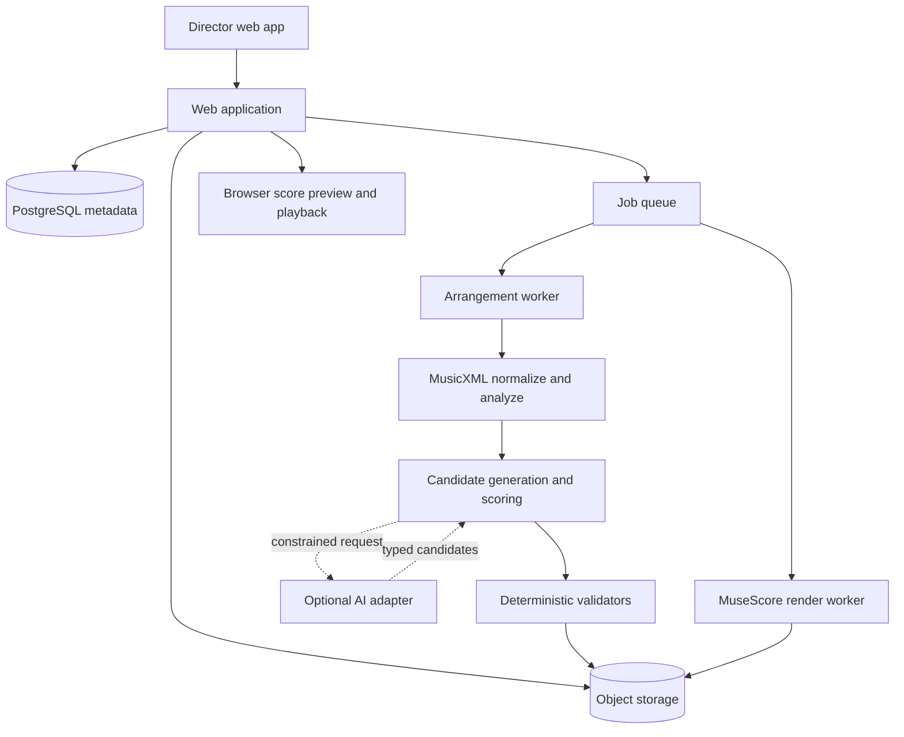

# Particular MVP - Plan

## Goal Capsule

- **Objective:** Deliver a director-facing application that converts an authorized MusicXML ensemble score into a family of coordinated, reviewable difficulty variants while preserving the identity and ensemble function of the piece.
- **Primary authority:** The Product Contract in this plan; when implementation discoveries conflict with it, stop and resolve the conflict rather than silently changing product behavior.
- **Execution profile:** Build the score engine and evaluation corpus first, prove it through a CLI vertical slice, and add the web workflow only after transformations are deterministic and measurable.
- **Stop conditions:** Stop for a product decision if the engine cannot preserve score synchronization, essential musical material, or valid written ranges without changing the agreed MVP scope.
- **Tail ownership:** The implementation includes documentation, automated verification, a small expert-reviewed reference corpus, deployment packaging, and a rehearsal-readiness pilot; it does not include public launch operations or copyrighted catalog acquisition.

---

## Product Contract

### Summary

Particular helps community, school, and youth ensemble directors include musicians with different technical abilities in the same performance.
The director uploads a machine-readable ensemble score, chooses a small set of generic difficulty tiers, and receives coordinated variants of every part.
Each variant remains synchronized with the original form and with every other tier so musicians can rehearse and perform together.

### Problem Frame

Mixed-ability ensembles often depend on directors or volunteer arrangers manually rewriting difficult passages, creating optional beginner parts, and checking that the resulting score still works as an ensemble.
That work is slow, demands instrument-specific arranging knowledge, and must be repeated for each piece.
Existing notation tools help transpose, extract, display, and edit parts, while fixed catalogs offer human-authored differentiated repertoire; neither gives a director a general-purpose way to generate coordinated difficulty tiers from their own score.

### Actors

- A1. **Ensemble director or arranger:** Owns the source score, chooses generation settings, reviews musical changes, and approves exports.
- A2. **Musician:** Receives and performs an exported part but does not interact with Particular during the MVP.
- A3. **Product evaluator:** A director, teacher, arranger, or instrument specialist who scores generated output against the reference rubric during development and pilot evaluation.

### Requirements

**Score intake and analysis**

- R1. The system accepts compressed and uncompressed MusicXML files and rejects unsupported, malformed, or unsafe uploads with actionable feedback.
- R2. The system preserves the unmodified source file, records its checksum and declared rights metadata when present, and creates all generated artifacts as derived versions.
- R3. The system normalizes the score into a canonical internal representation while retaining enough provenance to trace every transformed event back to its source part, measure, voice, and event.
- R4. The system reports score features that materially affect generation, including instruments, transpositions, sounding and written ranges, voices, tempo, meter, key, tuplets, repeats, divisi, percussion, and unsupported notation.

**Difficulty model and generation**

- R5. The system assigns explainable difficulty features to every part and passage rather than collapsing difficulty into a single opaque score.
- R6. Difficulty profiles account for general reading and execution demands plus instrument-family constraints, including range, note density, rhythmic subdivision, leaps, sustained endurance, articulations, and polyphony where applicable.
- R7. The director can generate three default tiers—Foundation, Core, and Challenge—from one score, while retaining the original as a fourth comparison state.
- R8. The generator applies deterministic, versioned transformation operators and produces the same result for the same source, configuration, and engine version.
- R9. Transformations preserve measure duration, rehearsal landmarks, global form, tempo map, meter, and alignment across all generated parts.
- R10. The generator preserves or deliberately reassigns essential melody, bass, harmonic support, rhythmic drive, entrances, cues, and exposed material so simplifying several parts does not hollow out the arrangement.
- R11. Every output remains within configured written and sounding ranges and satisfies instrument-specific hard constraints.
- R12. AI-assisted generation may propose or rank constrained alternatives, but deterministic validation owns acceptance and the product remains usable when AI is disabled or unavailable.

**Review and correction**

- R13. The director can inspect the original and generated tiers by score, part, and measure, with transformed passages visibly identified.
- R14. Each transformed passage explains which difficulty dimensions changed and which operator produced the change.
- R15. The director can regenerate a score with different global settings, lock measures against transformation, and override a part's default tier before export.
- R16. The MVP provides playback sufficient for comparison and rehearsal checking but does not promise studio-quality realization or a complete notation editor.
- R17. When the system cannot produce a valid result, it returns a partial result only if the affected measures and constraints are explicit; it never silently emits an invalid or unsynchronized score.

**Export and trust**

- R18. The system exports the complete generated score and individual parts as MusicXML, plus print-ready PDF when the rendering worker supports the uploaded notation.
- R19. Exports include a generation manifest containing source checksum, engine version, selected profile, transformation summary, warnings, and timestamps.
- R20. The system labels generated output as an arrangement requiring director review and does not claim that a difficulty tier corresponds to a universal grade level.
- R21. The initial product accepts only public-domain works, original works, and scores the uploader is authorized to arrange; it records the uploader's attestation before processing.
- R22. Uploaded and generated score files are private to the session owner, excluded from model training by default, encrypted in transit and at rest, and removable through the product workflow.

### Key Flows

- F1. **Upload and preflight**
  - **Trigger:** A1 selects a MusicXML or MXL file and confirms authorization to arrange it.
  - **Actors:** A1.
  - **Steps:** Validate the archive and XML; preserve the source; parse and normalize the score; inspect notation coverage, instruments, ranges, voices, and structural hazards; present a preflight report.
  - **Outcome:** The score is either ready for generation with disclosed warnings or rejected with specific remediation guidance.
  - **Covered by:** R1-R4, R21-R22.
- F2. **Generate coordinated tiers**
  - **Trigger:** A1 accepts preflight and starts generation with the default profiles or adjusted constraints.
  - **Actors:** A1.
  - **Steps:** Analyze difficulty and ensemble roles; create candidate transformations; optionally rank candidates with AI; validate hard constraints and ensemble invariants; persist accepted variants and their explanations.
  - **Outcome:** A versioned arrangement family exists, or the job ends with explicit unresolved constraints.
  - **Covered by:** R5-R12, R17.
- F3. **Review and refine**
  - **Trigger:** Generation succeeds or yields a reviewable partial result.
  - **Actors:** A1.
  - **Steps:** Compare source and tiers; filter to transformed measures; audition playback; inspect explanations and warnings; lock measures or adjust part tiers; regenerate a new immutable version.
  - **Outcome:** A1 approves one arrangement version for export.
  - **Covered by:** R13-R17.
- F4. **Export rehearsal materials**
  - **Trigger:** A1 approves a generated version.
  - **Actors:** A1, A2.
  - **Steps:** Produce score and part MusicXML; render PDFs; attach the manifest; package artifacts by tier and part.
  - **Outcome:** A1 downloads a reproducible rehearsal package that A2 can perform.
  - **Covered by:** R18-R20, R22.
- F5. **Evaluate output quality**
  - **Trigger:** A reference score or pilot arrangement is generated.
  - **Actors:** A3.
  - **Steps:** Score technical playability, musical fidelity, ensemble completeness, notation quality, and usefulness; record passage-level defects; compare results across engine versions.
  - **Outcome:** The team has evidence for whether a release improves the product rather than merely changing it.
  - **Covered by:** R5-R20.

### Acceptance Examples

- AE1. **Valid ensemble score:** Given an authorized orchestral MusicXML file containing transposing instruments, repeats, articulations, and multiple voices, when preflight completes, then Particular identifies the parts and structural features, preserves the source, and either enables generation or names each unsupported blocker.
- AE2. **Deterministic replay:** Given the same source checksum, generation profile, operator versions, and engine version, when generation runs twice, then the resulting canonical MusicXML and manifest are byte-equivalent after excluding timestamps.
- AE3. **Synchronized simplification:** Given a rapid sixteen-note passage in one part, when Foundation replaces it with a slower reduction, then that measure retains its original duration and every tier enters the following measure at the same musical position.
- AE4. **Protected musical role:** Given a passage where one instrument is the only carrier of the melody, when the engine considers removing notes from that part, then it either retains a recognizable melodic skeleton, reassigns essential notes to a valid instrument, or rejects the transformation.
- AE5. **Instrument safety:** Given a proposed note outside the configured written range of a beginner clarinet profile, when validation runs, then the candidate is rejected or octave-adjusted without changing the intended sounding harmony.
- AE6. **AI outage:** Given AI assistance is enabled but its provider times out, when generation runs, then Particular completes with deterministic ranking, records the degraded mode, and does not lose or corrupt the job.
- AE7. **Unsupported notation:** Given a score containing notation the parser or renderer cannot preserve reliably, when preflight runs, then Particular identifies the affected part and measures and prevents misleading PDF export while allowing safe MusicXML analysis if possible.
- AE8. **Director revision:** Given an approved generation whose Foundation violin part changed measures 12-15, when the director locks those measures and regenerates, then the new version leaves them unchanged and retains the previous version for comparison.
- AE9. **Rights boundary:** Given an uploader declines the authorization attestation, when they attempt processing, then the file is not stored or sent to a generation service.
- AE10. **Deletion:** Given a completed job with source and derived artifacts, when the owner deletes it, then database references and stored objects are removed according to the documented retention policy and can no longer be downloaded.

### Success Criteria

- At least 90% of scores in the MVP reference corpus complete preflight without a crash; unsupported constructs are identified at part-and-measure granularity.
- Every generated reference-corpus score passes structural invariants for duration, voice completeness, part alignment, parseability, and configured instrument ranges.
- At least 80% of generated Foundation and Core parts receive a score of “usable with minor edits” or better from two qualified evaluators during the pilot.
- At least 80% of evaluator-identified difficult passages show a lower measured difficulty vector in Foundation than Core, and in Core than Challenge, without a regression in ensemble-completeness checks.
- At least five target directors validate that mixed-ability part preparation is a recurring problem, provide representative score constraints, and commit to evaluating an engine prototype before the web application is built.
- A director can upload, generate, compare, and download a small ensemble score without documentation in a moderated usability session.
- Re-running an unchanged generation is reproducible, and every export can be traced to its source, settings, operators, and engine version.

### Scope Boundaries

#### Included in the MVP

- Western staff notation represented in MusicXML 4.x-compatible files.
- Common monophonic orchestral and band instruments, plus limited multi-voice handling needed to preserve imported parts.
- Generic Foundation, Core, and Challenge tiers coordinated across a complete ensemble score.
- Deterministic analysis, transformation, validation, browser review, basic playback, MusicXML export, and best-effort PDF export.
- A curated public-domain and synthetic test corpus with expert evaluation records.

#### Deferred for later

- Musician rosters, player-specific profiles, invitations, unique URLs, permissions, and self-service adjustments.
- Automatic PDF or image recognition, audio transcription, MIDI-only score intake, and handwritten notation.
- Full in-browser notation editing, collaborative annotations, rehearsal scheduling, and ensemble administration.
- Publisher catalog ingestion, blanket licensing, royalty accounting, and a marketplace for generated arrangements.
- Universal exam-board or grade-level labels; the MVP uses product-defined relative tiers and exposes the underlying difficulty dimensions.
- Fully automatic AI-generated arrangements without deterministic constraints or director approval.

#### Outside this product's identity

- Replacing a conductor or arranger's musical judgment.
- Generating finished audio recordings as the primary product.
- Circumventing copyright or publisher controls.

### Product Contract Preservation

Product Contract established by this plan from the confirmed conversation scope; no upstream Product Contract existed.

---

## Planning Contract

### Key Technical Decisions

- KTD1. **MusicXML is the canonical interchange format; MIDI is derived.** (session-settled: user-approved — chosen over MIDI as the canonical representation: score semantics and engraving information are required for safe transformation.) Source files remain immutable, while normalized internal data and exported MusicXML are versioned derivatives.
- KTD2. **The first milestone generates generic coordinated tiers.** (session-settled: user-approved — chosen over beginning with musician rosters and individualized permissions: it proves the arranging value before adding account complexity.)
- KTD3. **Use a deterministic engine with optional constrained AI assistance.** Parsing, transformation operators, validation, and export are deterministic. AI receives structured musical summaries rather than raw private files when possible, returns typed candidate rankings or proposals, and cannot bypass validators.
- KTD4. **Develop the engine as an independent Python package before the web application.** Python and `music21` provide the strongest current open-source MusicXML analysis and manipulation foundation. The package exposes a CLI and application service interface so algorithm work is testable without UI, database, or queue dependencies.
- KTD5. **Use a TypeScript web application with a narrow Python arrangement service.** The web layer owns upload UX, job status, review, and download authorization; the Python service owns musical domain logic. A generated OpenAPI client keeps the boundary typed.
- KTD6. **Use OpenSheetMusicDisplay for interactive preview and MuseScore Studio for print rendering.** Browser preview prioritizes quick comparison and highlighting; a containerized MuseScore conversion worker produces PDFs and rehearsal audio because browser renderers are not full notation editors and do not yet provide mature open playback.
- KTD7. **Store scores as immutable objects and generation metadata relationally.** Original and derived files live in S3-compatible object storage under opaque keys; PostgreSQL stores ownership, checksums, job state, configuration, manifests, and object references. Large MusicXML payloads do not live in database rows.
- KTD8. **Run generation and engraving asynchronously.** Web requests enqueue bounded jobs; workers report structured progress and can retry idempotent phases. The initial queue implementation may use Redis-backed workers, but the domain engine does not depend on the queue library.
- KTD9. **Difficulty is a vector, not a universal grade.** Each passage records measurable factors and instrument-profile adjustments. Tier policies target ranges across that vector and expose explanations instead of claiming equivalence to ABRSM, school grade, or another external syllabus.
- KTD10. **Generation is candidate search under hard and soft constraints.** Operators produce alternative passages; hard validators enforce musical time, parsing, range, and protected-role rules; a deterministic cost function selects the lowest-cost valid set across the ensemble. AI can influence candidate ordering or soft-cost weights only through a versioned adapter.
- KTD11. **Every generation is reproducible and auditable.** A generation version binds source checksum, normalized-score schema, instrument profiles, tier policies, operator versions, AI adapter and model metadata when used, random seed, and engine build.
- KTD12. **Treat score files as sensitive user content.** Validate archives against expansion attacks, parse XML with external entities disabled, isolate conversion workers, limit file size and complexity, use expiring downloads, and define deletion and retention behavior before pilot use.
- KTD13. **Use managed director authentication rather than building identity infrastructure.** The MVP needs authenticated ownership for private scores, deletion, and downloads, but it does not need musician identities, organizations, invitations, or custom roles. Keep the application boundary provider-neutral and require short-lived sessions plus server-side ownership checks on every score and artifact operation.
- KTD14. **Keep AI credentials and content transfer behind a server-side policy boundary.** Provider secrets live in the deployment secret manager, never in the browser, job payload, manifest, or logs. The adapter sends the minimum structured feature data needed, uses a provider setting that prohibits training or retention where available, and remains disabled until a privacy review and quality benchmark pass.

### High-Level Technical Design



The normalized score is the stable seam between import fidelity and generation logic.
Each musical event carries a source locator and semantic properties such as written pitch, sounding pitch, onset, duration, voice, instrument, notation marks, and structural role.
Generation creates a new immutable arrangement version rather than mutating the source or a previously approved version.

The engine processes a generation in these stages:

1. Validate and safely unpack the upload.
2. Parse and normalize MusicXML, recording coverage warnings and source locators.
3. Analyze passage difficulty and ensemble roles over phrase- or measure-sized windows.
4. Generate candidate transformations with versioned operators.
5. Select a compatible set of candidates across parts and tiers.
6. Validate structural, instrumental, harmonic, and role-preservation invariants.
7. Export canonical MusicXML and the generation manifest.
8. Render review assets and PDFs in isolated workers.

### Output Structure

```text
.
├── apps/
│   └── web/
│       ├── src/
│       └── tests/
├── packages/
│   ├── api-client/
│   └── contracts/
├── services/
│   └── arranger/
│       ├── particular/
│       │   ├── analysis/
│       │   ├── domain/
│       │   ├── generation/
│       │   ├── importers/
│       │   ├── validation/
│       │   └── exporters/
│       └── tests/
├── evaluation/
│   ├── corpus/
│   ├── fixtures/
│   ├── rubrics/
│   └── results/
├── infrastructure/
│   ├── containers/
│   └── deployment/
└── docs/
    ├── architecture/
    ├── product/
    └── plans/
```

### Generation Strategy

The initial deterministic operator library should be intentionally conservative:

- Thin repeated or ornamental notes while preserving metrically and harmonically important events.
- Reduce rhythmic subdivision through duration-aware note merging and rest insertion.
- Constrain range with octave displacement or role-preserving reassignment.
- Reduce leaps by selecting chord tones or nearby structural pitches.
- Simplify divisi or doubled voices while preserving measure completeness.
- Replace exposed rests with optional cue material only when the source score contains a safe donor line.
- Preserve melody contours, cadence tones, bass anchors, entrances, and rehearsal cues through protected-event annotations.

Operators do not independently rewrite whole parts.
They propose localized alternatives with preconditions, declared musical effects, difficulty deltas, and provenance.
The selector evaluates combinations because independently “easy” changes can collectively remove necessary harmony or rhythmic energy.

### Evaluation Strategy

Automated correctness and musical usefulness are separate gates.

- **Structural validation:** MusicXML schema/parse round-trip, measure duration, voice alignment, part count, transposition consistency, repeat/form preservation, and output determinism.
- **Instrument validation:** written and sounding range, supported polyphony, transition and leap constraints, articulation density, breath/endurance proxies, and family-specific rules.
- **Ensemble validation:** melody coverage, bass coverage, chord-tone coverage at structural points, rhythmic-activity floor, exposed entrance retention, and no all-tier dropout at a sounding event.
- **Relative-difficulty validation:** each lower tier improves targeted dimensions without introducing a harder dimension beyond profile tolerance.
- **Human evaluation:** qualified reviewers score playability, fidelity, meaningfulness, notation quality, rehearsal usefulness, and required edit effort at passage and score level.

The evaluation corpus must include synthetic edge cases and public-domain real scores across strings, winds, brass, percussion, mixed chamber groups, and unbalanced ensembles.
Corpus encodings and evaluator notes require explicit license and provenance metadata.

### Assumptions

- MusicXML input is produced by a notation application and is materially more reliable than OCR or audio transcription output.
- The first pilot can focus on common-practice tonal repertoire and conventional meters while reporting unsupported modern or extended notation.
- A director will review output before musicians receive it; automatic publication is not an MVP goal.
- Basic synthesized playback is sufficient for comparison, while MusicXML and PDF remain the authoritative rehearsal outputs.
- A small panel of directors and instrument teachers can participate in corpus review and pilot evaluation.

### Sequencing

The dependency-critical path is director-problem validation → domain vocabulary and fixtures → safe MusicXML round-trip → difficulty analysis → deterministic operators and validators → end-to-end CLI → service and job lifecycle → web review → export packaging → pilot evaluation.
Do not begin AI integration until the deterministic baseline and evaluation harness can quantify whether AI improves results.
Do not begin musician identity, organization, invitation, or musician-facing work during the MVP.

### System-Wide Impact

- **Privacy:** Scores may be unpublished or licensed material. Object access, logs, analytics, AI requests, backups, and deletion must all respect content privacy.
- **Security:** MXL is a ZIP container and MusicXML is XML; both require hostile-input controls. MuseScore conversion runs untrusted documents and belongs in an isolated, resource-limited worker.
- **Cost:** Engraving and AI assistance are the primary variable-cost surfaces. Generation manifests must record their use so product experiments can compare quality and cost.
- **Observability:** Job stages, validation failures, parser coverage warnings, render failures, and evaluator regressions need structured metrics without logging musical content.
- **Accessibility:** Review controls require keyboard navigation, readable transformation labels, and non-color-only change indicators. Exported parts must not rely on the web UI for essential warnings.

### Risks and Mitigations

| Risk | Consequence | Mitigation |
|---|---|---|
| MusicXML round trips lose notation or layout | Directors distrust exports or receive misleading parts | Preserve the source, maintain a coverage matrix, compare canonical semantics rather than layout bytes, warn at affected measures, and use MuseScore for print rendering |
| A generic difficulty model misjudges instrument-specific technique | “Simplified” parts remain hard or become unidiomatic | Use instrument profiles, expose feature vectors, add specialist-reviewed fixtures, and avoid universal grade claims |
| Independent part simplification damages the arrangement | Harmony, melody, or rhythmic drive disappears | Analyze roles across the full score and select candidates under ensemble-level coverage constraints |
| AI returns plausible but invalid music | Silent musical corruption | Use typed proposals, strict bounds, deterministic validation, provider-off fallback, and manifest provenance |
| Processing large scores times out or exhausts memory | Failed jobs and poor reliability | Asynchronous jobs, score-complexity limits, isolated workers, stage checkpoints, and cancellation |
| Public-domain status or encoding rights are unclear | Legal exposure | Require uploader attestation, track source and encoding licenses, begin with controlled corpus material, and obtain legal review before accepting commercial catalog content |
| Expert evaluation is too sparse | The team optimizes proxies instead of usefulness | Treat evaluator recruitment and rubric calibration as a release dependency, store passage-level feedback, and compare inter-rater agreement |
| Browser preview differs from PDF output | Review does not match rehearsal material | Make exported MusicXML/PDF authoritative, render final previews from export artifacts, and include cross-render smoke fixtures |

### Sources and Research

- [MusicXML 4.0](https://www.w3.org/2021/06/musicxml40/) defines the open score-interchange format and reports broad application support.
- [music21 documentation](https://music21.org/music21docs/usersGuide/usersGuide_08_installingMusicXML.html) documents MusicXML parsing and writing; the current project supports Python 3.11+ and uses a BSD 3-Clause license.
- [OpenSheetMusicDisplay](https://github.com/opensheetmusicdisplay/opensheetmusicdisplay) provides TypeScript browser rendering for MusicXML but explicitly describes itself as a renderer rather than a complete editor and lists playback as an early-access capability.
- [MuseScore Studio command-line usage](https://handbook.musescore.org/appendix) documents headless conversion and score-part PDF export suitable for isolated rendering workers.
- [Difficulty-Controlled Simplification of Piano Scores](https://arxiv.org/abs/2511.16228) supports MusicXML-based controlled simplification and open evaluation resources, while remaining piano-specific.
- [Automated Arrangements of Multi-Part Music for Sets of Monophonic Instruments](https://arxiv.org/abs/2301.12084) demonstrates deterministic MusicXML arrangement under instrument-range constraints and identifies reduction and polyphonic handling as extensions.
- [Musiplectics](https://vtechworks.lib.vt.edu/items/de037f42-25e7-4011-9040-c28147ae33f0) motivates instrument- and proficiency-specific difficulty features rather than a universal scalar.
- [Piano score rearrangement into multiple difficulty levels](https://link.springer.com/article/10.1186/s13636-023-00321-7) demonstrates notation-to-notation generation at controlled levels but does not solve coordinated orchestral differentiation.

---

## Implementation Units

### U13. Validate the director workflow and recruit design partners

- **Goal:** Confirm that the observed problem is recurring, costly enough to motivate adoption, and represented accurately before committing to the full web product.
- **Requirements:** R1-R22; validates the problem frame and supplies inputs for F1-F5.
- **Dependencies:** None.
- **Files:** `docs/product/interview-guide.md`, `docs/product/research-consent.md`, `docs/product/problem-validation.md`, `docs/product/design-partner-criteria.md`, `evaluation/corpus/intake/README.md`.
- **Approach:** Interview at least five community, school, or youth ensemble directors who currently adapt parts or avoid repertoire because of mixed ability. Collect the current workflow, time spent, ensemble composition, source formats, difficulty judgments, copyright constraints, trust concerns, and willingness to review generated parts. Recruit at least three design partners and request representative scores only through the documented authorization and consent process.
- **Patterns to follow:** Separate evidence from conclusions; minimize personal data; do not place interview recordings, private scores, contact details, or raw notes in the repository.
- **Test scenarios:** Test expectation: none—this is product research. The evidence gate is completion of the interview synthesis and design-partner commitments without storing private research data in git.
- **Verification:** The synthesis identifies recurring workflows and measurable pain across at least five directors, three partners agree to review a prototype, and the Product Contract is revised before engine work if evidence contradicts its core assumptions.

### U1. Establish project foundations and domain vocabulary

- **Goal:** Create the monorepo skeleton, contribution standards, architecture records, shared contracts, and initial product documentation needed for parallel engine and web work.
- **Requirements:** R1-R22; establishes shared language and traceability rather than user-visible behavior.
- **Dependencies:** None.
- **Files:** `README.md`, `AGENTS.md`, `CONCEPTS.md`, `package.json`, `pnpm-workspace.yaml`, `pyproject.toml`, `docs/architecture/0001-system-boundaries.md`, `docs/product/difficulty-model.md`, `docs/product/rights-and-privacy.md`, `.github/workflows/ci.yml`.
- **Approach:** Define score, source score, normalized score, passage, instrument profile, difficulty vector, tier profile, operator, candidate, arrangement family, generation, and manifest as canonical terms. Establish TypeScript and Python formatting, linting, typing, testing, and generated-contract conventions. Document the web/service/worker boundary and the rule that musical logic lives in the engine package.
- **Patterns to follow:** Conventional commits; repo-local instructions; ADRs for decisions that constrain more than one implementation unit.
- **Test scenarios:** Test expectation: none—this unit is repository and documentation scaffolding; CI smoke validation belongs in Verification.
- **Verification:** A clean checkout can install both ecosystems, run placeholder validation commands, and render the documentation links without broken paths.

### U2. Build the licensed reference corpus and evaluation schema

- **Goal:** Create the fixtures and scoring infrastructure that make algorithm changes measurable before generation logic is written.
- **Requirements:** R4-R6, R9-R12, R20-R22; F5.
- **Dependencies:** U1, U13.
- **Files:** `evaluation/corpus/manifest.yaml`, `evaluation/fixtures/`, `evaluation/rubrics/arrangement-review.md`, `evaluation/rubrics/review.schema.json`, `evaluation/scripts/validate_corpus.py`, `services/arranger/tests/evaluation/test_corpus.py`.
- **Approach:** Start with small synthetic scores that isolate meter, voices, transposition, tuplets, repeats, ties, divisi, percussion, range, melody coverage, bass coverage, and harmonic coverage. Add a small set of public-domain ensemble scores with explicit encoding provenance. Define passage- and score-level reviewer fields and a format that can be diffed across engine versions.
- **Execution note:** Add fixtures incrementally with the parser and validators so each fixture proves a named capability or failure mode.
- **Patterns to follow:** Every corpus item carries composer/work status, encoding source, encoding license, instrumentation, expected parser coverage, and intended test use.
- **Test scenarios:**
  1. A corpus entry without source or license metadata fails validation.
  2. A fixture checksum change without a manifest update fails validation.
  3. Every declared fixture parses with the reference parser or is explicitly marked as an expected rejection.
  4. Review records validate required fields, allowed scales, evaluator role, and engine version.
- **Verification:** Corpus validation produces a stable inventory and CI can select fixtures by feature, instrument family, and expected result.

### U3. Implement safe MusicXML intake and canonical round-trip

- **Goal:** Parse MXL and MusicXML into a normalized score with source provenance, coverage warnings, and reproducible export.
- **Requirements:** R1-R4, R9, R11, R17, R21-R22; F1; AE1, AE2, AE7, AE9.
- **Dependencies:** U1, U2.
- **Files:** `services/arranger/particular/importers/musicxml.py`, `services/arranger/particular/importers/security.py`, `services/arranger/particular/domain/score.py`, `services/arranger/particular/exporters/musicxml.py`, `services/arranger/particular/preflight.py`, `services/arranger/tests/importers/test_musicxml.py`, `services/arranger/tests/importers/test_security.py`, `services/arranger/tests/exporters/test_musicxml.py`, `services/arranger/tests/test_preflight.py`.
- **Approach:** Wrap `music21` behind an adapter so its objects do not leak throughout the domain. Safely unpack MXL with file-count, total-size, per-entry-size, compression-ratio, path, and nested-archive limits. Disable XML external entities and network access. Normalize score events with source locators and explicitly represent unsupported or lossy constructs. Export from normalized data and compare semantic fingerprints on round-trip.
- **Execution note:** Begin with security and semantic round-trip tests; do not accept “the file opens” as sufficient proof.
- **Patterns to follow:** Immutable domain records at module boundaries; typed error categories; no raw score content in logs.
- **Test scenarios:**
  1. Covers AE1. A valid multi-part score with transposing instruments and voices produces the expected part inventory and source locators.
  2. Covers AE2. Two round trips yield identical semantic fingerprints and canonical XML aside from declared volatile fields.
  3. A malformed XML document returns a typed parse error without persisting a derived score.
  4. MXL path traversal, external entity, nested archive, decompression bomb, excessive-entry, and oversized-file cases are rejected before parsing.
  5. Covers AE7. Unsupported notation produces part-and-measure coverage warnings and an export capability flag.
  6. A partial or pickup measure retains its intended duration semantics rather than being padded incorrectly.
  7. Written and sounding pitches survive transposing-instrument round-trip.
- **Verification:** The corpus preflight report is stable, safe-input tests pass, and every supported fixture round-trips without structural invariant failures.

### U4. Define instrument profiles and explainable difficulty analysis

- **Goal:** Produce passage-level difficulty vectors and relative tier targets for supported instrument families.
- **Requirements:** R5-R7, R11, R20; F2, F5.
- **Dependencies:** U2, U3.
- **Files:** `services/arranger/particular/domain/difficulty.py`, `services/arranger/particular/domain/instruments.py`, `services/arranger/particular/analysis/difficulty.py`, `services/arranger/particular/analysis/segmentation.py`, `services/arranger/particular/profiles/instruments/`, `services/arranger/particular/profiles/tiers.yaml`, `services/arranger/tests/analysis/test_difficulty.py`, `services/arranger/tests/analysis/test_segmentation.py`, `services/arranger/tests/profiles/test_instruments.py`.
- **Approach:** Compute independent features for tempo-adjusted note density, shortest duration, syncopation and subdivision, interval size and transition frequency, written/sounding range position, accidental and key burden, articulation changes, sustained duration, rest opportunity, polyphony, and notation complexity. Apply versioned instrument-profile weights and hard limits. Segment at musically stable boundaries while retaining measure-granular locators.
- **Patterns to follow:** Profiles are declarative and versioned; computed features retain raw values and normalized contributions; no single score is presented as objective truth.
- **Test scenarios:**
  1. Increasing tempo or note density raises the relevant feature without changing unrelated features.
  2. The same written passage yields different difficulty contributions for violin, clarinet, and trumpet profiles where their mechanics differ.
  3. Empty, rest-only, percussion, multi-voice, pickup, and tied-across-boundary passages analyze without exceptions.
  4. Passage boundaries never split an indivisible event or lose source locators.
  5. Foundation, Core, and Challenge targets are ordered by each profile's declared tolerances.
  6. A score outside supported profiles receives an explicit generic-profile warning rather than a fabricated instrument-specific assessment.
- **Verification:** Golden feature vectors pass for synthetic fixtures, instrument specialists can inspect the contribution breakdown, and the engine never emits a universal grade label.

### U5. Analyze ensemble roles and protected musical material

- **Goal:** Identify material that simplification must retain or safely reassign across the complete score.
- **Requirements:** R9-R10, R14, R17; F2; AE4.
- **Dependencies:** U3, U4.
- **Files:** `services/arranger/particular/domain/roles.py`, `services/arranger/particular/analysis/harmony.py`, `services/arranger/particular/analysis/roles.py`, `services/arranger/tests/analysis/test_harmony.py`, `services/arranger/tests/analysis/test_roles.py`.
- **Approach:** Build a time-aligned ensemble view and label candidate melody, bass, harmonic anchor, rhythmic drive, exposed entrance, doubling, cue, and rest functions using explainable heuristics. Store confidence and evidence rather than forcing one role per note. Protect structural events and measure ensemble coverage before and after each candidate combination.
- **Patterns to follow:** Conservative protection when confidence is low; sounding-pitch analysis for harmony; written-pitch output for parts.
- **Test scenarios:**
  1. Covers AE4. A unique melody line is protected or safely reassigned when simplification would remove its structural pitches.
  2. Doubled melody material may be thinned in one part without losing global melody coverage.
  3. Bass and chord-tone coverage are measured in sounding pitch across transposing parts.
  4. Unison, sparse, percussion-led, rest-heavy, and ambiguous textures retain explicit confidence and do not crash.
  5. Exposed entrances and rehearsal cues remain protected even when their local difficulty is high.
- **Verification:** Synthetic role fixtures match expected labels and coverage, and reviewers can trace every protected event to observable evidence.

### U6. Implement deterministic transformation operators

- **Goal:** Generate localized, explainable simplification candidates without mutating source material.
- **Requirements:** R7-R11, R14-R15; F2-F3; AE3, AE5, AE8.
- **Dependencies:** U4, U5.
- **Files:** `services/arranger/particular/generation/operators/base.py`, `services/arranger/particular/generation/operators/rhythm.py`, `services/arranger/particular/generation/operators/density.py`, `services/arranger/particular/generation/operators/range.py`, `services/arranger/particular/generation/operators/intervals.py`, `services/arranger/particular/generation/operators/voices.py`, `services/arranger/particular/generation/locks.py`, `services/arranger/tests/generation/operators/`, `services/arranger/tests/generation/test_locks.py`.
- **Approach:** Each operator declares preconditions, tier applicability, input and output locators, difficulty delta, musical-role effects, and a stable version. Operators work on bounded passages and return candidates rather than committing changes. Locks exclude source events or measures before candidate generation.
- **Execution note:** Develop each operator test-first against one synthetic success fixture and at least one rejection fixture before enabling it in a tier policy.
- **Patterns to follow:** Pure functions over immutable passage snapshots; stable candidate identifiers derived from source and operator inputs.
- **Test scenarios:**
  1. Covers AE3. Rhythmic reduction preserves total voice duration and synchronization.
  2. Density reduction retains protected metric, melodic, and harmonic events.
  3. Covers AE5. Range adjustment respects written and sounding limits and does not introduce forbidden transitions.
  4. Interval reduction lowers leap cost without changing measure duration or protected contour points.
  5. Voice reduction preserves required rests, ties, tuplets, and voice completeness.
  6. Covers AE8. Locked events and measures produce no candidates and remain unchanged after regeneration.
  7. Applying an operator to an ineligible passage returns a reasoned no-op rather than malformed output.
- **Verification:** Every operator has deterministic golden outputs, declared invariants, explanation snapshots, and corpus-wide mutation tests showing it cannot alter locked or out-of-scope events.

### U7. Select and validate coordinated arrangement families

- **Goal:** Choose compatible candidates across all parts and tiers, enforce hard constraints, and emit a complete auditable generation.
- **Requirements:** R7-R12, R17, R19-R20; F2; AE2-AE6.
- **Dependencies:** U3-U6.
- **Files:** `services/arranger/particular/generation/selector.py`, `services/arranger/particular/generation/policies.py`, `services/arranger/particular/validation/structure.py`, `services/arranger/particular/validation/instruments.py`, `services/arranger/particular/validation/ensemble.py`, `services/arranger/particular/domain/manifest.py`, `services/arranger/tests/generation/test_selector.py`, `services/arranger/tests/validation/`, `services/arranger/tests/domain/test_manifest.py`.
- **Approach:** Model selection as deterministic constrained optimization over candidates. Hard failures include time misalignment, invalid voices, parse failure, range violations, protected-event loss, and ensemble-coverage floors. Soft costs balance target difficulty, fidelity, edit count, role confidence, and tier monotonicity. Emit accepted and rejected candidate reasons in a manifest without exposing private musical content to logs.
- **Patterns to follow:** Stable ordering and tie-breaking; explicit resource ceilings; validators are independently runnable against any generated score.
- **Test scenarios:**
  1. Covers AE2. Candidate input order does not change selected output or manifest semantics.
  2. Covers AE3. A selected family passes measure and voice alignment across every tier.
  3. Covers AE4. Candidate combinations that collectively remove required melody or bass coverage are rejected.
  4. Covers AE5. Any out-of-range candidate is rejected before export.
  5. A lower tier does not exceed the higher tier's targeted difficulty dimensions unless the manifest records an unavoidable, reviewed exception.
  6. An infeasible passage produces a localized failure with failed constraints rather than invalid output.
  7. Selector resource limits return a typed exhausted result and preserve recoverable candidates.
- **Verification:** All reference fixtures pass hard invariants, generation is reproducible, and manifest diffs explain every score change across engine versions.

### U8. Deliver the engine CLI and optional AI adapter

- **Goal:** Prove the complete arrangement workflow independently of the web application and establish a safe extension point for AI experiments.
- **Requirements:** R1-R20; F1-F5; AE1-AE7.
- **Dependencies:** U2-U7.
- **Files:** `services/arranger/particular/cli.py`, `services/arranger/particular/application/generate.py`, `services/arranger/particular/ai/base.py`, `services/arranger/particular/ai/deterministic.py`, `services/arranger/particular/ai/provider.py`, `services/arranger/tests/application/test_generate.py`, `services/arranger/tests/ai/test_provider.py`, `services/arranger/tests/test_cli.py`.
- **Approach:** Expose preflight, analyze, generate, validate, and evaluate commands with machine-readable results. The deterministic adapter is the baseline. A provider adapter receives bounded feature summaries and candidate metadata, returns a schema-validated ranking or proposals limited to declared operator actions, and falls back on timeout, invalid output, or policy denial.
- **Execution note:** Ship the deterministic CLI vertical slice before activating any remote AI request; benchmark AI experiments against the same corpus and rubric.
- **Patterns to follow:** Dependency inversion at the AI boundary; explicit provider policy; recorded model and prompt version; no provider credentials or raw responses in manifests.
- **Test scenarios:**
  1. A CLI generation produces score, tier parts, manifest, warnings, and evaluation summary in a clean output directory.
  2. Invalid input exits nonzero with structured error output and no partial artifact leakage.
  3. Covers AE6. Provider timeout, refusal, malformed schema, oversized request, and unavailable credentials fall back deterministically.
  4. AI proposals outside the declared operator vocabulary are rejected.
  5. Provider-disabled and provider-fallback runs match the deterministic baseline.
  6. Cancellation leaves the source intact and marks temporary derived artifacts for cleanup.
- **Verification:** A documented CLI command processes the MVP reference corpus, deterministic mode meets the invariant gates, and AI mode cannot worsen hard-validator results.

### U9. Add the arrangement API, persistence, and job lifecycle

- **Goal:** Provide authenticated upload, asynchronous generation, versioning, deletion, and download contracts for the web application.
- **Requirements:** R1-R4, R7, R13-R22; F1-F4; AE1, AE6-AE10.
- **Dependencies:** U8.
- **Files:** `services/arranger/particular/api/`, `services/arranger/particular/jobs/`, `services/arranger/particular/storage/`, `services/arranger/migrations/`, `services/arranger/openapi.yaml`, `services/arranger/tests/api/`, `services/arranger/tests/jobs/`, `services/arranger/tests/storage/`, `packages/api-client/`.
- **Approach:** Use FastAPI around the application service, PostgreSQL for job and generation metadata, S3-compatible storage for immutable artifacts, and an isolated worker process for generation. Define a state machine for uploaded, preflighting, ready, generating, reviewable, failed, cancelled, exporting, complete, and deleted states. All mutating requests are idempotent or carry an idempotency key; downloads use short-lived authorization.
- **Patterns to follow:** OpenAPI is the web boundary; managed authentication establishes the director identity; every query and object operation checks ownership server-side; migrations are forward-compatible; object paths are opaque; job progress contains stage and counts but no score content.
- **Test scenarios:**
  1. Covers AE1. A valid upload proceeds through preflight and exposes warnings and readiness.
  2. Duplicate upload or generation requests with the same idempotency key do not create duplicate objects or jobs.
  3. Invalid state transitions, unauthorized downloads, expired links, and cross-owner access are rejected.
  4. Missing, expired, forged, and revoked director sessions cannot upload, inspect, regenerate, delete, or download score artifacts.
  5. Covers AE6. Worker failure and retry do not duplicate generations or lose the deterministic fallback result.
  6. Covers AE8. Regeneration creates a new immutable version and preserves its parent.
  7. Covers AE9. No file persists before rights attestation is accepted.
  8. Covers AE10. Deletion removes downloadable objects and relational references according to retention rules.
  9. Cancellation between each job stage produces a terminal, recoverable state and cleans temporary artifacts.
- **Verification:** API contract tests, migration tests, storage integration tests, and worker state-machine tests pass against local PostgreSQL, object storage, and queue services.

### U10. Build the director review web application

- **Goal:** Let a director complete upload, preflight, generation, comparison, locking, regeneration, and download without using the CLI.
- **Requirements:** R1, R4, R7, R13-R22; F1-F4; AE1, AE7-AE10.
- **Dependencies:** U9.
- **Files:** `apps/web/src/app/`, `apps/web/src/components/score/`, `apps/web/src/components/generation/`, `apps/web/src/lib/api/`, `apps/web/src/lib/playback/`, `apps/web/tests/unit/`, `apps/web/tests/integration/`, `apps/web/tests/e2e/`.
- **Approach:** Use a TypeScript web app and generated API client. Render MusicXML with OpenSheetMusicDisplay, synchronize source and tier navigation by semantic source locators, and overlay transformed-measure markers with textual explanations. Use MIDI-derived playback for auditioning without treating playback as authoritative notation. Make long-running stages resumable after navigation or reload.
- **Patterns to follow:** Server-owned job state; accessible controls; non-color change indicators; progressive disclosure for musical analysis; no attempt to implement arbitrary note editing.
- **Test scenarios:**
  1. A keyboard-only user can upload, acknowledge rights, review preflight, start generation, compare tiers, and download output.
  2. Covers AE7. Unsupported measures are visibly identified and unsafe export actions are unavailable with an explanation.
  3. Selecting a transformed measure highlights corresponding source and tier positions and shows its operator and difficulty deltas.
  4. Playback starts at the selected measure, follows score position, and clearly labels itself as synthesized preview.
  5. Covers AE8. Locking measures and regenerating creates and selects a new version without overwriting the prior version.
  6. Reloading during any job stage restores the current state and progress.
  7. API failure, job failure, expired download, deletion, and empty-score states offer actionable recovery.
  8. Responsive layouts keep review controls and score navigation usable on a laptop-sized viewport; mobile may be read-only or unsupported with clear messaging.
- **Verification:** Unit and integration tests pass, browser tests cover F1-F4, automated accessibility checks report no serious violations, and a director can complete the moderated usability task.

### U11. Add engraving, export packaging, and cross-render verification

- **Goal:** Produce rehearsal-ready score and part packages with traceable MusicXML, PDFs, manifests, and warnings.
- **Requirements:** R18-R22; F4; AE2, AE7, AE10.
- **Dependencies:** U7, U9.
- **Files:** `services/arranger/particular/exporters/package.py`, `services/arranger/particular/jobs/engrave.py`, `infrastructure/containers/musescore/Dockerfile`, `services/arranger/tests/exporters/test_package.py`, `services/arranger/tests/jobs/test_engrave.py`, `evaluation/fixtures/rendering/`.
- **Approach:** Run a pinned MuseScore Studio build in a network-disabled, resource-limited container. Render from the exported MusicXML used for download, not a parallel internal representation. Package conductor score and individual parts by tier, include the manifest and human-readable warning summary, and preserve stable filenames inside each archive.
- **Patterns to follow:** Content-addressed intermediate artifacts; isolated conversion; deterministic packaging order and metadata; renderer version in manifest.
- **Test scenarios:**
  1. A supported generation exports parseable score and part MusicXML plus readable PDFs for each selected tier.
  2. Covers AE2. Repeated packaging is byte-stable after normalizing timestamps and renderer metadata where possible.
  3. Covers AE7. A known unsupported-rendering fixture blocks PDF while retaining safe MusicXML export and warnings.
  4. Renderer crash, timeout, excessive page count, and malformed output produce typed failures without exposing worker internals.
  5. Package filenames are safe across operating systems and cannot escape the archive root.
  6. Covers AE10. Deleted packages and intermediate render artifacts cannot be downloaded.
- **Verification:** Cross-render fixtures are visually smoke-reviewed, exported MusicXML re-enters preflight without new structural errors, and package manifests account for every file.

### U12. Operationalize evaluation and run the MVP pilot

- **Goal:** Establish release gates, observability, privacy operations, and evidence that directors find generated parts usable.
- **Requirements:** R1-R22; F5; all acceptance examples.
- **Dependencies:** U8-U11.
- **Files:** `evaluation/scripts/run_benchmark.py`, `evaluation/scripts/compare_results.py`, `evaluation/results/baseline.json`, `docs/product/pilot-protocol.md`, `docs/operations/privacy-and-deletion.md`, `docs/operations/worker-runbook.md`, `infrastructure/deployment/`, `.github/workflows/evaluation.yml`.
- **Approach:** Pin a deterministic baseline, run corpus evaluation on engine changes, and fail CI on hard-invariant regressions. Collect human reviews through a controlled pilot, calibrate the rubric, record inter-rater disagreement, and convert recurring defects into fixtures. Add stage-level metrics, privacy-safe errors, worker health checks, backup and deletion tests, and cost attribution for render and AI usage.
- **Patterns to follow:** No score content in telemetry; benchmark results are versioned artifacts; human evaluation remains distinct from automated proxy scores.
- **Test scenarios:**
  1. A change that introduces duration, range, parse, or ensemble-coverage regression fails the evaluation gate.
  2. A deliberate baseline update requires an explicit result diff and reviewer approval.
  3. Metrics identify job stage, duration, failure class, engine version, and resource use without source titles, notes, or raw MusicXML.
  4. Backup restoration preserves metadata-object consistency and access controls.
  5. Retention and deletion jobs remove expired content and expose auditable counts without content.
  6. Pilot review records validate evaluator consent, role, rubric completeness, and engine version.
- **Verification:** The corpus meets automated success criteria, the pilot meets or clearly reports misses against human-usefulness criteria, operational runbooks are exercised, and no launch-blocking privacy or security finding remains.

---

## Verification Contract

| Gate | Applies to | Required outcome |
|---|---|---|
| Director problem validation | U13 | Five target-director interviews and three design-partner commitments validate the workflow before full product build |
| Python formatting, linting, and static typing | U1-U9, U11-U12 | All arranger and evaluation code passes the pinned formatter, linter, and type checker |
| Python unit and integration tests | U2-U9, U11-U12 | Domain, parser, generator, validator, API, worker, storage, and export scenarios pass |
| TypeScript formatting, linting, and type checking | U1, U9-U10 | Web and generated client code pass the pinned checks without ignored errors |
| Web unit and integration tests | U10 | Review state, score navigation, explanations, locks, playback controls, and error recovery pass |
| Browser end-to-end tests | U10-U11 | F1-F4 pass in a production-like stack with representative score fixtures |
| Corpus validation | U2-U12 | Every fixture has provenance, expected coverage, stable checksums, and valid metadata |
| Structural score invariants | U3, U6-U8, U11-U12 | All generated reference scores parse and preserve duration, voices, alignment, form, and transposition |
| Instrument and ensemble invariants | U4-U8, U12 | No configured range violation or protected-role coverage regression reaches export |
| Determinism | U3, U6-U8, U11-U12 | Same inputs and engine configuration produce the same canonical artifacts and semantic manifest |
| Security tests | U3, U9, U11-U12 | Hostile archives/XML, unauthorized access, worker isolation, and deletion cases pass |
| Accessibility checks | U10 | Automated checks show no serious violations and keyboard flow completes |
| Human evaluation | U2, U12 | Pilot output meets the documented usefulness threshold or the MVP remains pre-release with defects recorded |

The concrete command names should be finalized in U1 and recorded in the root README and CI configuration.
CI must provide one aggregate fast gate for routine changes and a separate corpus/evaluation gate for musical-engine changes.

---

## Definition of Done

- The application completes F1-F4 for supported MusicXML scores and produces traceable score, part, manifest, and PDF artifacts.
- Every requirement is covered by an implementation unit and verified by an automated, expert, operational, or explicitly documented manual gate.
- All acceptance examples pass in automated or pilot verification as appropriate.
- The supported-notation and supported-instrument matrices are documented with measure-level failure behavior for unsupported cases.
- Deterministic mode meets every structural, instrument, and ensemble hard invariant across the reference corpus.
- AI-assisted mode is optional, bounded by the same validators, and demonstrably improves at least one agreed human or automated quality measure before it is enabled by default.
- At least two qualified reviewers assess each pilot score used for the human-usefulness release threshold, with disagreements retained rather than averaged away invisibly.
- Upload authorization, privacy, retention, deletion, access control, and isolated rendering behavior are documented and exercised.
- The director workflow passes browser, accessibility, and moderated usability verification.
- CI and the evaluation workflow are green from a clean checkout using documented setup steps.
- README, architecture decisions, domain vocabulary, support matrix, operator documentation, and operational runbooks reflect the implemented system.
- Experimental, abandoned, and superseded implementation paths are removed from the final diff; version control retains the history.
- No launch-blocking security, privacy, licensing, score-integrity, or evaluator-usefulness issue remains unresolved.
